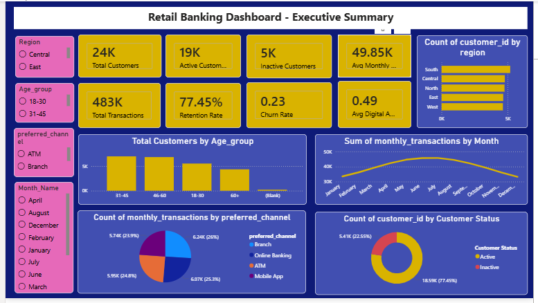
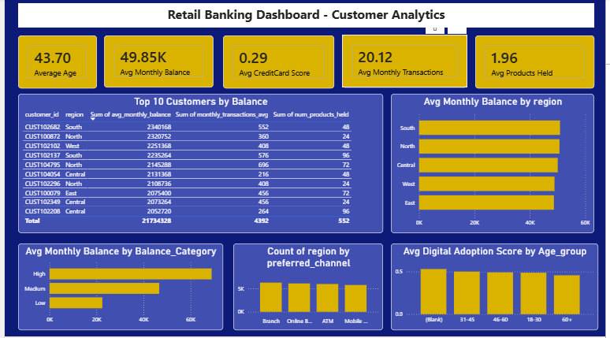
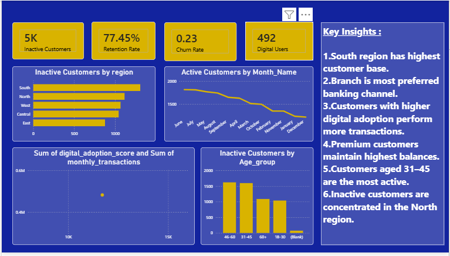

# 🏦 Retail Banking Customer Analytics

> An end-to-end Data Analytics project that analyzes retail banking customer data using **Python, SQL, Excel, Machine Learning, and Power BI** to uncover customer behavior, improve retention strategies, and support business decision-making.

---

# 📌 Project Overview

Retail banks generate large volumes of customer and transaction data every day. This project demonstrates how data analytics can be used to transform raw banking data into actionable business insights.

The project covers the complete analytics lifecycle—from data preprocessing and feature engineering to exploratory data analysis (EDA), machine learning, and interactive Power BI dashboards.

---

# 🎯 Business Problem

Banks need to understand:

- Which customers are active and inactive?
- Which regions contribute the highest customer base?
- Which customers maintain higher balances?
- How do customers use different banking channels?
- Which customer segments require retention campaigns?
- How can digital banking adoption be improved?

This project answers these business questions using data-driven analysis.

---

# 🎯 Project Objectives

- Analyze customer demographics
- Study customer transaction behavior
- Evaluate account balances
- Analyze digital banking adoption
- Identify inactive customers
- Segment customers using Machine Learning
- Build interactive Power BI dashboards
- Generate business insights.

---

# 🛠 Tools & Technologies

| Tool | Purpose |
|------|----------|
| Python | Data Cleaning & Analysis |
| Pandas | Data Manipulation |
| NumPy | Numerical Operations |
| Matplotlib | Data Visualization |
| SQL | Data Analysis |
| Excel | Initial Data Exploration |
| Scikit-Learn | Machine Learning |
| Power BI | Dashboard Development |
|  GitHub | Version Control |

---

# 📂 Project Workflow

```text
Raw Data
      │
      ▼
Data Preprocessing
      │
      ▼
   SQL
      │
      ▼
Feature Engineering
      │
      ▼
Exploratory Data Analysis
      │
      ▼
Machine Learning
      ├── Logistic Regression
      └── K-Means Clustering
      │
      ▼
Power BI Dashboard
      │
      ▼
Business Insights & Recommendations
```

---

# 📁 Repository Structure

```text
Retail-Banking-Customer-Analytics
│
├── 01_Dataset
├── 02_Data_Preprocessing
├── 03_SQL_Merging Data
├── 04_Feature_Engineering
├── 05_Exploratory_Data_Analysis
├── 06_Machine_Learning
├── 07_PowerBI_Dashboard
├── 08_Project_Report
├── Notebooks
├── Images
├── README.md
└── requirements.txt
└── License
```

---

# 🧹 Data Preprocessing

The following preprocessing steps were performed:

- Imported customer and transaction datasets
- Checked dataset dimensions and structure
- Handled missing values
- Removed duplicate records
- Converted data types
- Standardized column names
- Converted transaction dates to datetime format
- Merged customer and transaction datasets
- Exported cleaned dataset for analysis

---

# ⚙️ Feature Engineering

New features were created to improve business analysis and machine learning performance.

### Engineered Features

- Age Group
- Balance Category
- Month Name
- Active Customer Flag
- Digital Adoption Score
- Customer Segmentation Features
- Product Holding Metrics

Additional processing included:

- Label Encoding
- One-Hot Encoding
- Feature Scaling
- Date Feature Extraction

---

# 📊 Exploratory Data Analysis (EDA)

EDA was performed to understand customer behavior and identify trends.

Key analyses include:

- Customer distribution by region
- Gender analysis
- Age distribution
- Preferred banking channels
- Monthly transaction trends
- Average account balances
- Digital adoption analysis
- Correlation analysis
- Outlier detection

---

# 🤖 Machine Learning

## 1. Customer Activity Prediction

**Algorithm Used**

- Logistic Regression

Tasks performed:

- Train-Test Split
- Model Training
- Model Evaluation
- Classification Report
- Confusion Matrix
- ROC-AUC Analysis

---

## 2. Customer Segmentation

**Algorithm Used**

- K-Means Clustering

Tasks performed:

- Feature Selection
- Data Scaling
- Cluster Creation
- Cluster Interpretation
- Business Segmentation

---

# 📈 Power BI Dashboard

The project includes three interactive dashboard pages.

## Dashboard 1 – Executive Summary

- Customer KPIs
- Active vs Inactive Customers
- Customers by Region
- Monthly Transaction Trends
- Preferred Banking Channels
- Age Group Distribution

---

## Dashboard 2 – Customer Analytics

- Customer Segmentation
- Balance Analysis
- Top Customers
- Product Holding Analysis
- Digital Adoption
- Regional Performance

---

## Dashboard 3 – Customer Retention

- Retention Rate
- Inactive Customer Analysis
- Regional Retention
- Monthly Active Customers
- Customer Engagement
- Business Insights

---

# 📷 Dashboard Preview







# 📌 Key Business Insights

- Analyzed approximately 24,000 retail banking customers.
- Customer retention rate is 77.45%, indicating strong customer engagement.
- Around 22.55% of customers are inactive, representing an opportunity for targeted retention campaigns.
- The South region has the highest customer base.
- Customers maintain an average monthly balance of approximately ₹49.85K.
- Transaction activity peaks during July–August.
- Customers aged 31–45 represent the largest customer segment.
- Digital banking adoption is consistent across customer groups.

---

# 🚀 Skills Demonstrated

- Data Cleaning
- Data Preprocessing
- Feature Engineering
- Exploratory Data Analysis
- SQL Querying
- Data Visualization
- Machine Learning
- Customer Segmentation
- Business Intelligence
- Dashboard Design
- Business insights

---

# 👩‍💻 Author

**Vedanti Madane**

Aspiring Data Analyst passionate about transforming raw data into actionable business insights using Python, SQL, Excel, and Power BI.

---

⭐ If you found this project useful, feel free to star the repository!
